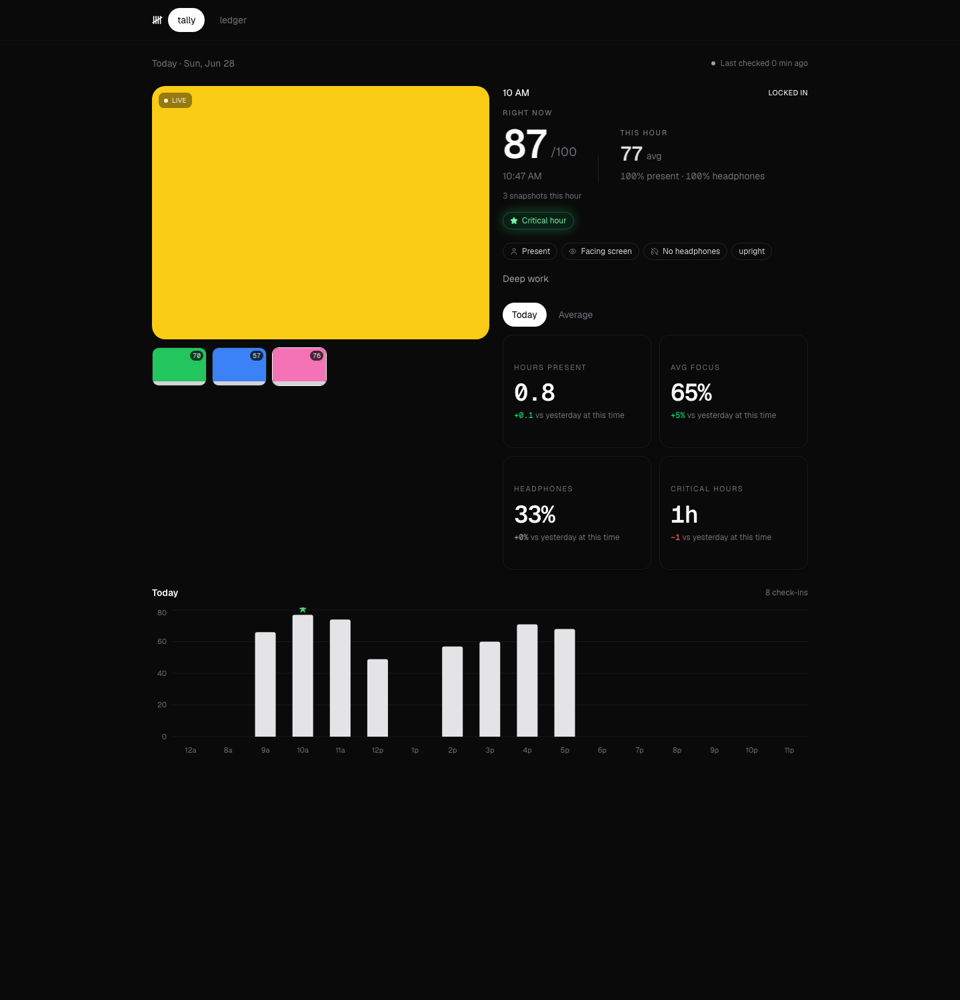
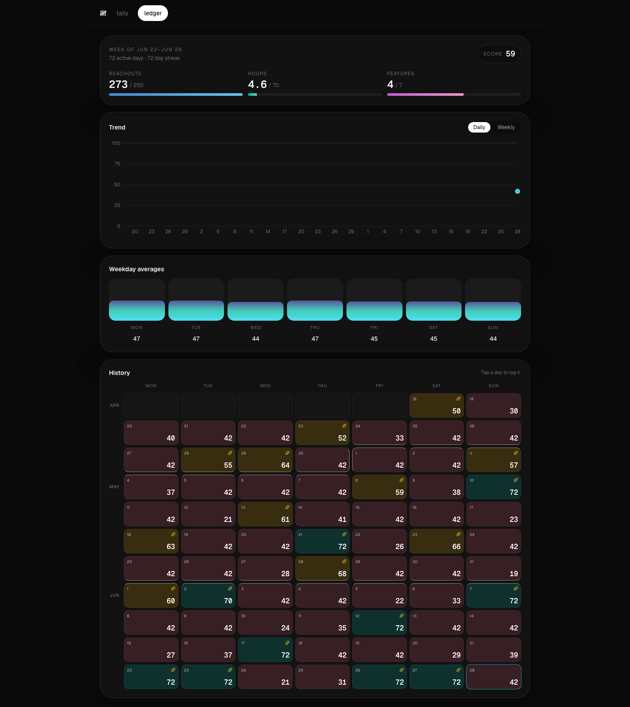
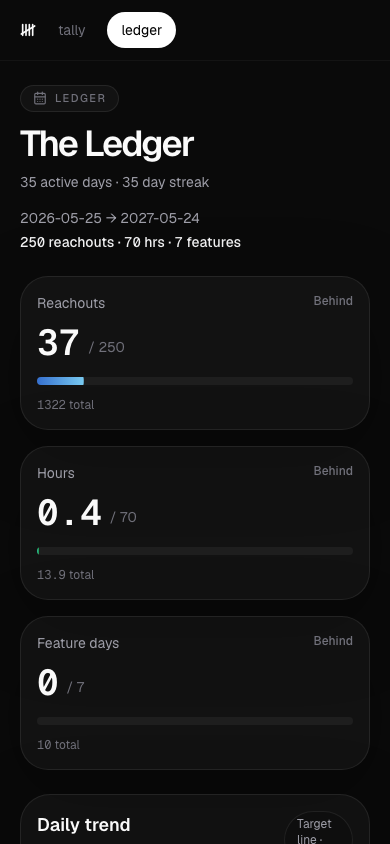

# live-work

A self-hosted webcam presence tracker and habit ledger. A `launchd` job on my
Mac takes a snapshot every 5 minutes, a vision model scores whether I'm
actually at the desk and locked in (not just present), and a Next.js
dashboard turns the day into a live "tally" and the quarter into a
week-by-week "ledger."

Deployed at [livework-one.vercel.app](https://livework-one.vercel.app).

|                              Tally (live, today)                              |                            Ledger (weekly history)                            |
| :-----------------------------------------------------------------------------: | :-----------------------------------------------------------------------------: |
|  |  |



## How it works

```
launchd (every 5 min, macOS)
  -> zsh -> imagesnap                     grabs one webcam frame
  -> capture.ts POST /api/browser-capture (bearer: OWNER_SECRET)

/api/browser-capture
  -> dHash dedup                          skip the vision call if the frame is unchanged
  -> face detector (COCO-SSD, tfjs-wasm)  no face -> "away", vision model skipped entirely
  -> AFK backoff                          away 30min -> sample every 15min; away 60min -> every 30min
  -> vision model (Qwen VL)               present + headphones -> {present, headphones, note}
  -> score = 30 x present + 70 x headphones
  -> Neon Postgres: snapshots + hourly_checkins (thumbnail stored inline as a data: URI)
  -> inline hourly rollup                 (no cron on Vercel's Hobby plan)

Next.js dashboard (/  and  /ledger)
  -> tally: today's score, current streak, hour-by-hour bar chart
  -> ledger: 13-week reachouts/hours/feature-day history vs. weekly targets
```

Presence is decided **deterministically** by the face detector, not the vision
model — a frame with no detectable face is recorded as "away" without ever
calling the VLM. That keeps the vast majority of ticks free.

## Stack

- **App**: Next.js 15 (App Router) + React 19, Tailwind v4, shadcn/ui + HeroUI, Recharts
- **Data**: Neon Postgres via `@vercel/postgres` — schema is created and
  self-migrated lazily on first request (`ensureSchema` in `lib/store.ts`;
  that function is the single source of truth for the schema)
- **Vision**: COCO-SSD (vendored, offline, `models/coco-ssd/`) for presence
  detection, Qwen VL (OpenAI-compatible) for the present/headphones/note read
- **Agent**: a tiny `zsh` + `bun` capture loop driven by `launchd` (see
  [`agent/README.md`](agent/README.md))
- **Hosting**: Vercel

## Repo layout

```
app/                 Next.js routes — dashboard pages + the capture/dashboard API
components/          Dashboard, Ledger, and shared UI (components/ui is shadcn)
lib/                 Capture pipeline, scoring, presence detection, ledger math, store
agent/               launchd capture agent that runs on the local Mac (see its README)
scripts/             One-off/maintenance scripts (model vendoring, lint runner, purges)
models/coco-ssd/     Vendored TensorFlow.js model, traced into the API routes at build
tests/               bun:test unit tests
docs/screenshots/    README media
```

## Local development

```sh
bun install
cp .env.example .env.local   # fill in secrets, see below
bun run dev                  # http://localhost:3100
```

Useful scripts:

```sh
bun run typecheck                # tsc --noEmit
bun run lint                     # project lint pass
bun run lint:file -- <file>      # lint a single file
bun test tests                   # unit tests
bun scripts/vendor-coco-ssd.ts   # refresh the vendored presence-detection model
```

### Environment variables

See [`.env.example`](.env.example) for the full list. In short:

- `CAPTURE_SECRET` / `OWNER_SECRET` / `CRON_SECRET` — bearer secrets for the
  capture, browser-capture, and rollup endpoints respectively
- `DASHSCOPE_API_KEY` (or `QWEN_API_KEY`) + `WORK_LIVE_QWEN_BASE_URL` — the
  vision model
- `WORK_LIVE_BASE_URL`, `WORK_LIVE_TIME_ZONE`, `WORK_LIVE_CAMERA_NAME` — agent
  target and local capture config
- `POSTGRES_URL` — injected automatically by the Vercel Neon integration in
  production; unset locally falls back to on-disk thumbnails
- Telegram nudge + build-counter vars (`TELEGRAM_*`, `GITHUB_*`, `OPENROUTER_KEY`, `SNOOZE_MODEL`) — see "Accountability nudges (Telegram)" below

## Accountability nudges (Telegram)

Three feedback loops layer onto the ledger: **sell** (replies + meetings booked
→ weekly reply-rate and booking-rate), **build** (auto commits/merges to the
build repo), and **anti-slack** — a Telegram bot that nudges when you're not at
your desk by 8am, behind the outreach checkpoints, or wandered off mid-day.
Replies are two-way: a cheap LLM judges whether your excuse is plausible and
either grants a snooze or pushes back ("lunch at 3pm? really?"). The whole
conversation shows on `/ledger`. The engine runs server-side on a 5-minute
external cron; the capture agent is not involved.

Setup:

1. **Bot token** — message [@BotFather](https://t.me/BotFather), `/newbot`, and
   copy the token into `TELEGRAM_BOT_TOKEN`.
2. **Chat id** — send your bot any message, then
   `GET https://api.telegram.org/bot<token>/getUpdates` and read
   `result[].message.chat.id` into `TELEGRAM_CHAT_ID`.
3. **Webhook** — register this app as the reply webhook:
   `POST https://api.telegram.org/bot<token>/setWebhook` with
   `url=https://<app>/api/telegram` and `secret_token=<TELEGRAM_WEBHOOK_SECRET>`
   (any long random string; the route rejects requests whose
   `x-telegram-bot-api-secret-token` header doesn't match).
4. **Build counts** — a GitHub PAT with read access to the build repo →
   `GITHUB_TOKEN`; set `GITHUB_REPO` (e.g. `tombridger1030/platform`) and
   `GITHUB_AUTHOR` (your GitHub login).
5. **Snooze interpreter** — `OPENROUTER_KEY` (or `OPENROUTER_API_KEY`) and
   `SNOOZE_MODEL` (the cheapest model that passes `bun scripts/eval-snooze.ts`;
   default `mistralai/mistral-small-24b-instruct-2501`, which scored 8/8 on the
   labeled cases).
6. **Deploy** — set all of the above in Vercel and redeploy.
7. **Cron** — point a free scheduler (e.g. cron-job.org) at
   `POST https://<app>/api/accountability` every 5 minutes with
   `Authorization: Bearer <CRON_SECRET>`. The sweep is idempotent, so the exact
   cadence isn't load-bearing: the 8am and outreach nudges fire regardless of
   whether the Mac is awake; the "wandered off" nudge only when a fresh capture
   exists.

## The capture agent

The webcam side of this runs locally via `launchd`, not on Vercel — cameras
aren't reachable from a serverless function. Setup, the macOS TCC/`imagesnap`
gotchas, and the deployment architecture are documented in
[`agent/README.md`](agent/README.md).

## License

[MIT](LICENSE)
